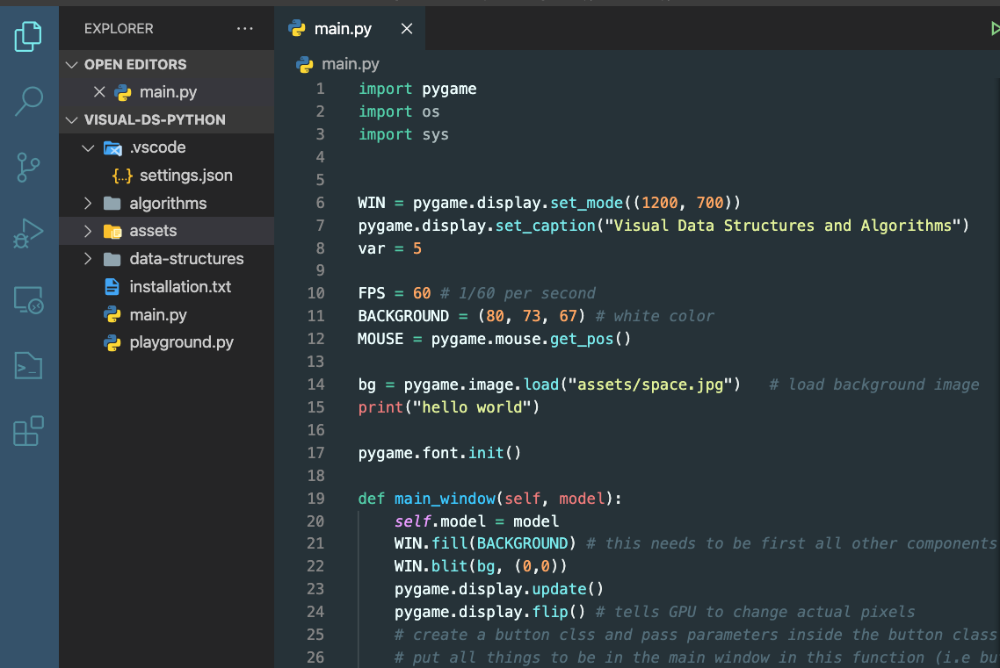

# Tropical Sky for Visual Studio Code 
## About
This theme is a personal project :

* Specifically designed for Python and Json files however, this extension works for any language, syntax, files, etc. 
* The extension is in its infancy and will be properly maintained, modified and improved over time. 
* Take a look at the screen shot below. 

Future Development :

* Hopefully improve the look for javascript, html, C and C++, specifically!
* Improve existing support for this theme. 

### Author
* [@prestonjayhil](https://github.com/PrestonJayHil)

### Version Log

* [1.0.0] - 2021-08-07

**Enjoy!**

Python
